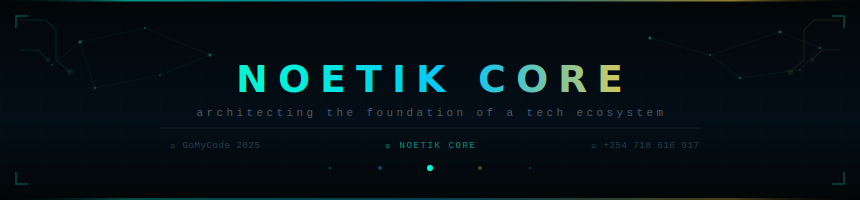

<div align="center">

</div>

<br/>

<div align="center">

[](https://git.io/typing-svg)

</div>

<br/>

<div align="center">


&nbsp;

&nbsp;

&nbsp;

&nbsp;


</div>

---

## ◈ Live GitHub Stats

<div align="center">


</div>

<div align="center">


</div>

---

## ◈ Contribution Activity

<div align="center">

[](https://github.com/edwinnyandika)

</div>

---

## ◈ Connect & Support

<div align="center">

[](https://github.com/edwinnyandika)
&nbsp;
[](https://www.instagram.com/_.silenttrendz._)
&nbsp;
[](https://buymeacoffee.com/edwinfrelaa)

</div>

<br/>

<div align="center">

<a href="https://buymeacoffee.com/edwinfrelaa" target="_blank">
  
</a>

<br/><br/>

<a href="https://buymeacoffee.com/edwinfrelaa" target="_blank">
  
</a>

<br/>

*📲 Scan the QR to support*

</div>

---

<div align="center">

*NOETIK CORE — architecting the foundation of a tech ecosystem ⚡*

</div>
&nbsp;

&nbsp;


</div>

<br/>

---


---

## ◈ Projects


<div align="center">

[](https://github.com/edwinnyandika/Folio)
&nbsp;
[](https://github.com/edwinnyandika/oratore)
&nbsp;
[](https://github.com/edwinnyandika/gomycode-cli-assignment)

</div>

---

## ◈ Tech Stack

<div align="center">


</div>

---

## ◈ GitHub Stats

<div align="center">


</div>

<div align="center">


</div>

---

## ◈ Contribution Activity

<div align="center">

[](https://github.com/edwinnyandika)

</div>

---


---


<div align="center">

[](https://github.com/edwinnyandika)
&nbsp;
[](https://www.instagram.com/_.silenttrendz._)
&nbsp;
[](https://buymeacoffee.com/edwinfrelaa)

</div>

---

## ◈ Support My Work

<div align="center">

*If you believe in builders who are just getting started — every coffee fuels the next build.* ☕

<br/>

<a href="https://buymeacoffee.com/edwinfrelaa" target="_blank">
  
</a>

<br/><br/>

<a href="https://buymeacoffee.com/edwinfrelaa" target="_blank">
  
</a>

<br/>

*📲 Scan to buy Edwin a coffee*

</div>

---

<div align="center">

</div>

</div>

<br/>

<div align="center">


&nbsp;

&nbsp;

&nbsp;


</div>

---

## ◈ About Me

```ts
const edwin: Developer = {
  name      : "Edwin Nyandika",
  role      : "Software Developer · Trader · Designer",
  org       : "NOETIK CORE",
  school    : "GoMyCode Software Development Bootcamp",
  building  : ["Folio — AI Portfolio App", "Oratore — AI Speaker Tool"],
  poweredBy : ["TypeScript", "React", "Vite", "Gemini API"],
  interests : ["AI Products", "Trading Systems", "Design-led Dev"],
  workStyle : "Remote 🏠",
  motto     : "From 'Hello World' to Market Disruptor ⚡",
};

// currently: shipping, learning, and building in public 🚀
```

---

## ◈ Projects

<div align="center">

<table>
<tr>
<td width="33%" align="center">

<a href="https://github.com/edwinnyandika/Folio">


</a>

**AI-Powered Portfolio**


</td>
<td width="33%" align="center">

<a href="https://github.com/edwinnyandika/oratore">


</a>

**AI Speaker Tool**


</td>
<td width="33%" align="center">

<a href="https://github.com/edwinnyandika/gomycode-cli-assignment">


</a>

**CLI Filesystem Mastery**


</td>
</tr>
</table>

</div>

---

## ◈ Tech Stack

<div align="center">


</div>

---

## ◈ GitHub Stats

<div align="center">


</div>

<div align="center">


</div>

---

## ◈ Contribution Activity

<div align="center">

[](https://github.com/edwinnyandika)

</div>

---

## ◈ Currently Learning

<div align="center">

| | Focus | Why |
|---|---|---|
| 🧱 | Software Architecture | Building systems that scale |
| 🤖 | AI App Development | Gemini · Claude · LLM tooling |
| 📈 | Trading + Code | Bridging markets and software |
| 🎨 | Design-led Engineering | Products that feel as good as they work |
| ⚡ | CLI & DevOps Foundations | Every serious dev needs the terminal |

</div>

---

## ◈ Connect

<div align="center">

[](https://github.com/edwinnyandika)
&nbsp;
[](https://www.instagram.com/_.silenttrendz._)
&nbsp;
[](https://buymeacoffee.com/edwinfrelaa)

</div>

---

## ◈ Support My Work

<div align="center">

*If you believe in builders who are just getting started — every coffee fuels the next build.* ☕

<br/>

<a href="https://buymeacoffee.com/edwinfrelaa" target="_blank">
  
</a>

<br/><br/>

<a href="https://buymeacoffee.com/edwinfrelaa" target="_blank">
  
</a>

<br/>

*📲 Scan to support*

</div>

---

<div align="center">


</div>
