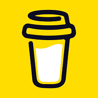

<!-- ============================================================
     EDWIN NYANDIKA — GitHub Profile README
     NOETIK CORE · Software · Trading · Design
     ============================================================ -->

<!-- ██████████████████████████████████████████████████████████
     HERO — Custom SVG: Cinematic dark with geometric orb,
     constellation nodes, animated circuit lines, live pulse
██████████████████████████████████████████████████████████ -->

<div align="center">

</div>

<div align="center">

[](https://git.io/typing-svg)

</div>

<div align="center">


</div>

<br/>

---

<!-- ██████████████████████████████████████████████████████████
     WORD SCROLL — "I build ___"
     Animated SVG: 18 words cycling with oklch color spectrum,
     sliding underline, scroll-position dot tracker, fade masks.
     Faithfully implements the CSS scroll-driven animation pattern
     as a self-contained SVG animation.
██████████████████████████████████████████████████████████ -->

<div align="center">

</div>

---

<!-- ██████████████  GOMYCODE BANNER  ██████████████ -->

<div align="center">

```
╔═══════════════════════════════════════════════════════════════════════════╗
║                                                                           ║
║   ██████╗  ██████╗ ███╗   ███╗██╗   ██╗ ██████╗ ██████╗ ██████╗ ███████╗ ║
║  ██╔════╝ ██╔═══██╗████╗ ████║╚██╗ ██╔╝██╔════╝██╔═══██╗██╔══██╗██╔════╝ ║
║  ██║  ███╗██║   ██║██╔████╔██║ ╚████╔╝ ██║     ██║   ██║██║  ██║█████╗   ║
║  ██║   ██║██║   ██║██║╚██╔╝██║  ╚██╔╝  ██║     ██║   ██║██║  ██║██╔══╝   ║
║  ╚██████╔╝╚██████╔╝██║ ╚═╝ ██║   ██║   ╚██████╗╚██████╔╝██████╔╝███████╗ ║
║   ╚═════╝  ╚═════╝ ╚═╝     ╚═╝   ╚═╝    ╚═════╝ ╚═════╝ ╚═════╝ ╚══════╝ ║
║                                                                           ║
║        🎓  Software Development Bootcamp  ·  Class of 2025               ║
║        ⚡  From CLI to Cloud · From Hello World to AI Applications        ║
║                                                                           ║
╚═══════════════════════════════════════════════════════════════════════════╝
```


</div>

---

<!-- ██████████████  ABOUT ME  ██████████████ -->

## 🧠 `about.ts`

```typescript
const edwin: Developer = {

  name        :  "Edwin Nyandika",
  role        :  "Software Developer · Trader · Designer",
  org         :  "NOETIK CORE",
  school      :  "GoMyCode — Software Development Bootcamp 🎓",
  location    :  "Remote 🏠",

  building    :  [
                   "Folio    — AI-Powered Portfolio App  🗂️",
                   "Oratore  — AI Speaker & Comms Tool   🎙️",
                 ],

  poweredBy   :  [ "TypeScript", "React", "Vite", "Gemini API", "Claude API" ],
  interests   :  [ "AI Products", "Trading Systems", "Design-led Dev" ],

  phone       :  "+254 718 616 917",   // 📞 available for client work
  motto       :  "From 'Hello World' to Market Disruptor ⚡",

};

// ► currently: shipping, learning & building in public 🚀
```

---

<!-- ██████████████  PROJECTS  ██████████████ -->

## 🚀 Projects

<div align="center">

<table>
<tr>
<td align="center" width="270">


### 🗂️ [FOLIO](https://github.com/edwinnyandika/Folio)

```
AI-Powered Portfolio
Google AI Studio
Gemini API
```


</td>
<td align="center" width="270">


### 🎙️ [ORATORE](https://github.com/edwinnyandika/oratore)

```
AI Speaker & Comms Tool
Articulate with confidence
Powered by Gemini
```


</td>
<td align="center" width="270">


### 💻 [CLI ASSIGN](https://github.com/edwinnyandika/gomycode-cli-assignment)

```
Filesystem CLI Mastery
Git Bash · Termux · Android
Zero GUI. Pure Terminal.
```


</td>
</tr>
</table>

</div>

---

<!-- ██████████████  TECH STACK  ██████████████ -->

## 🛠️ Tech Stack

<div align="center">

```
╭──────────────────── LANGUAGES & FRAMEWORKS ─────────────────╮
```


```
╭──────────────────────── TOOLS & PLATFORMS ──────────────────╮
```


```
╭──────────────────────────── AI & APIS ──────────────────────╮
```


```
╭────────────────────────────── ENV ──────────────────────────╮
```


</div>

---

<!-- ██████████████  GITHUB STATS  ██████████████ -->

## 📊 GitHub Stats

<div align="center">


</div>

<div align="center">


</div>

---

<!-- ██████████████  ACTIVITY GRAPH  ██████████████ -->

## 🌊 Contribution Activity

<div align="center">

[](https://github.com/edwinnyandika)

</div>

---

<!-- ██████████████  CURRENTLY LEARNING  ██████████████ -->

## 💡 Currently Learning

<div align="center">

| | Focus Area | Progress | Why |
|:---:|:---|:---:|:---|
| 🧱 | **`software architecture.`** | `████████░░` 80% | Systems that scale |
| 🤖 | **`AI app development.`** | `██████░░░░` 65% | Gemini · Claude · LLMs |
| 📈 | **`trading systems + code.`** | `█████░░░░░` 50% | Markets meet software |
| 🎨 | **`design-led engineering.`** | `████████░░` 80% | Feels as good as it works |
| ⚡ | **`CLI · DevOps · Bash.`** | `██████░░░░` 60% | Terminal mastery |
| 🌐 | **`full-stack foundations.`** | `███████░░░` 70% | End-to-end thinking |

</div>

---

<!-- ██████████████  CONNECT  ██████████████ -->

## 🔗 Connect

<div align="center">

[](https://github.com/edwinnyandika)
&nbsp;
[](https://www.instagram.com/_.silenttrendz._)
&nbsp;
[](https://buymeacoffee.com/edwinfrelaa)

</div>

<br/>

<div align="center">

```
╭──────────────────────────────────────────────────────────╮
│   📞  +254 718 616 917  ·  Available for client work     │
│   Click number to select and copy                        │
╰──────────────────────────────────────────────────────────╯
```

📞 **`+254 718 616 917`**

</div>

---

<!-- ██████████████  BUY ME A COFFEE  ██████████████ -->

## ☕ Support My Work

<div align="center">

```
╭──────────────────────────────────────────────────────────╮
│                                                          │
│   If you believe in builders who are just getting        │
│   started — every coffee fuels the next build. 🙏        │
│                                                          │
│   buymeacoffee.com/edwinfrelaa                           │
│                                                          │
╰──────────────────────────────────────────────────────────╯
```

<a href="https://buymeacoffee.com/edwinfrelaa" target="_blank">
  
</a>

<br/><br/>

<a href="https://buymeacoffee.com/edwinfrelaa" target="_blank">
  
</a>

<br/>

`📲 Scan QR to support · or tap the button above`

</div>

---

<!-- ██████████████  FOOTER  ██████████████
     Custom SVG: constellation map, triple-color line,
     circuit nodes, pulsing center dot, NOETIK CORE
████████████████████████████████████████ -->

<div align="center">

</div>
